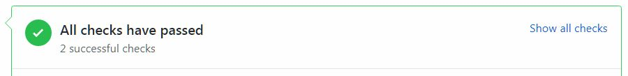
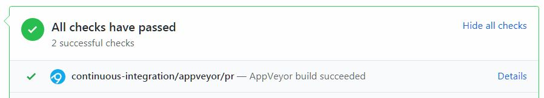
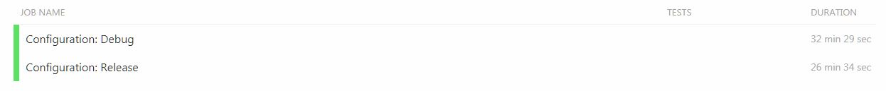
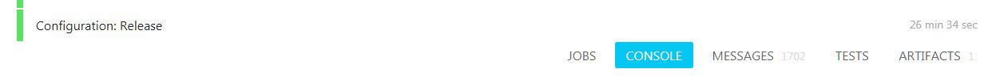
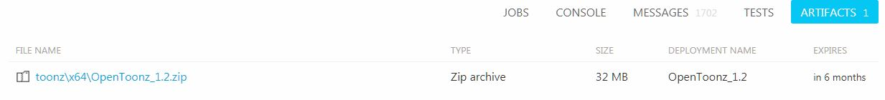

# Testing Pull Requests (PRs)

When a PR is submitted, it is compiled automatically by AppVeyor and Travis CI. The AppVeyor build creates an artifact which contains the OpenToonz executable, supporting DLLs needed to run and the stuff directory containing configuration files, preferences and menus.  You can easily download this artifact and run it to test out the PR before it is merged.

## Testing with a portable release of Opentoonz
The AppVeyor build can easily be made into a portable version of Opentoonz for easy storage on USB device or for easy sharing.
Simply rename the included 'Opentoonz stuff' directory as 'portablestuff' and move it into the Opentoonz directory where Opentoonz.exe is located.  If the portablestuff directory is not present the AppVeyor build will utilize the stuff directory located at C:\Opentoonz stuff.  Note that required files may not be present in the default stuff directory and use of portablestuff directory is recommended.

## Pre-Testing Notes
- This can only be tested on Windows. There is no OSX or Linux build that can be tested.
- You need to have OpenToonz already installed.  Do not uninstall.
- Your current personal preferences and settings will be used.
  - Personal settings can change if you change them while testing.
  - It is recommended that you backup your `C:\OpenToonz stuff` folder before testing a PR using that directory.
- The AppVeyor build now contains an updated `OpenToonz stuff` folder and any PR changes to default configurations (i.e. stylesheets, FXs, brushes, etc) will be located in the accompanying stuff folder.
- It is recommended when testing to use new scenes that you can throw away.
  - If you decide to test on an existing scene, back it up first!

## Downloading and Testing AppVeyor Builds

- Go to the PR you are interested in checking out.

- Scroll to the bottom of the page and look for the green-outlined box with `All checks have passed` in it. Click on `Show all checks` next to it.

- Look for where it says `AppVeyor build succeeded` and click on the `Details` next to it.

- Click on `Configuration: Release`.

- On the right side of the page, click on `Artifacts`.

- Click on the OpenToonz `.zip` file to begin the download.

- Once download is complete, go to your Downloads folder and extract the contents of the .zip file anywhere on your computer.
 - You should extract into a separate folder. 
 - ⚠️ **Do not overwrite your current OpenToonz installation!**

- Enter the folder you extracted everything into and double-click the OpenToonz executable to start.

- Test away!  Report any suggestions or issues related to the change in the PR comments.

- You can safely delete the .zip file and the folder you created when you are done.
